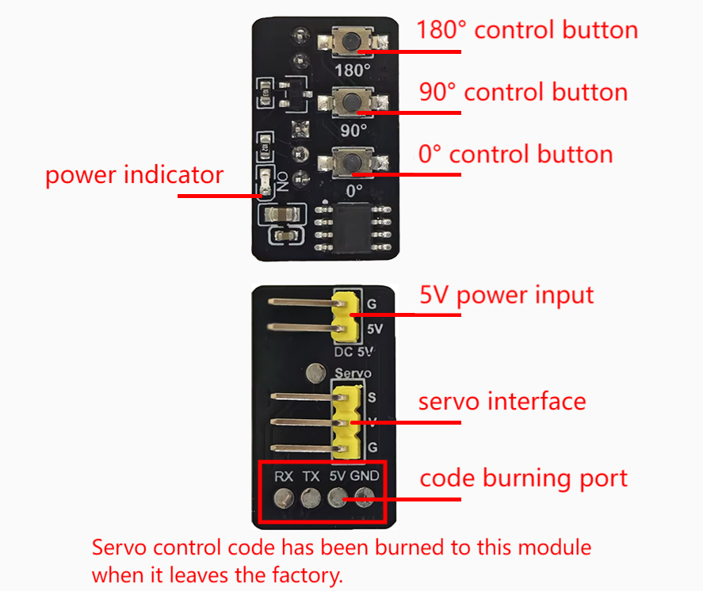

# MD0798 Servo Control Module

## 1. Introduction

The module is a servo Angle preset controller, which is based on the high-performance STC8G1K08 single-chip microcomputer. It is able to precisely rotate the connected servo to three preset positions of **0 degrees**, **90 degrees** or **180 degrees** with one click on three physical buttons, making the operation intuitive and convenient. Besides, it integrates a **PMOS transistor power anti-reverse protection** circuit to effectively enhance its reliability and safety.

## 2. Parameters

Power supply: DC 5V

Power input interface: 2-pin curved pin

Applicable servos: Suitable for most 180-degree servos of 3V-5V

Servo interface: 3-pin curved pin

Control mode: Standard pulse (500us: 0 degrees, 1500us: 90 degrees, 2500us: 180 degrees)

Dimensions: 25x15x8mm

## 3. Schematic Diagram

## 4. Usage Method

When in use, connect the 5V power supply to the 5V power input port of the module (note the positions of VCC and GND). After powering on, the power indicator will light up. Connect the servo that needs to set the angle to the servo interface. Pins are as follows:

|      Module      | Pin  |      Servo       | Wire color |
| :--------------: | :--: | :--------------: | :--------: |
| servo signal pin |  S   | servo signal pin |   yellow   |
|       VCC        |  V   |       VCC        |    red     |
|       GND        |  G   |       GND        |   orange   |

After wiring up, press the buttons on the module to control the servo angle. Press the “0° Control button” to rotate the servo to 0 degrees, pressing the “90° control button” to rotate it to 90 degrees, and pressing the “180° Control button” to rotate it to 180 degrees.